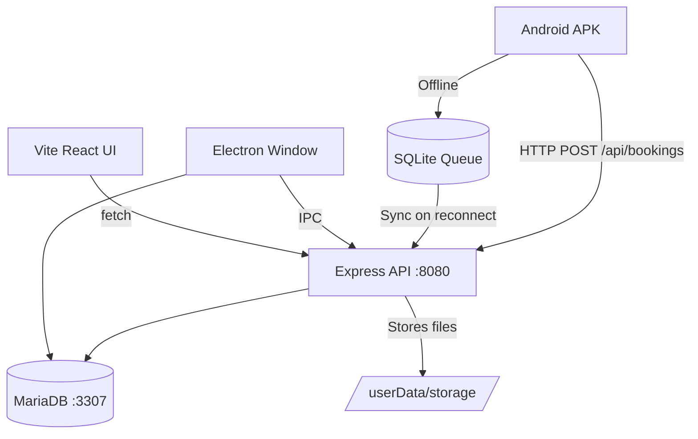

# Hotel Check-In & Data Tracker

<div align="center">

```
 ██╗  ██╗ ██████╗ ████████╗███████╗██╗
 ██║  ██║██╔═══██╗╚══██╔══╝██╔════╝██║
 ███████║██║   ██║   ██║   █████╗  ██║
 ██╔══██║██║   ██║   ██║   ██╔══╝  ██║
 ██║  ██║╚██████╔╝   ██║   ███████╗███████╗
 ╚═╝  ╚═╝ ╚═════╝    ╚═╝   ╚══════╝╚══════╝
 CHECK-IN & DATA TRACKER  ·  v1.0.0
```

**A production-ready, 100% local, zero-cloud hotel check-in system.**


</div>

---

## Overview

This system replaces cloud-dependent hotel management software with a **fully self-contained, on-premises solution**. All guest data stays on your hardware — no subscriptions, no external servers, no internet dependency for daily operations.

```
┌─────────────────────────────────────────────────────────────────┐
│                    HOTEL NETWORK                                │
│                                                                 │
│   ┌──────────────────────────────┐                             │
│   │   Windows Desktop (EXE)      │  ◄── Local MariaDB          │
│   │   • Room Management          │  ◄── Express API :8080      │
│   │   • Booking Dashboard        │  ◄── Vite + React UI        │
│   │   • Pairing QR Generator     │                             │
│   └──────────┬───────────────────┘                             │
│              │  LAN / Tailscale VPN                            │
│              ▼                                                  │
│   ┌──────────────────────────────┐                             │
│   │   Android APK (Reception)    │  ◄── Offline SQLite Queue   │
│   │   • Group Check-In Wizard    │  ◄── Camera + Edge Guide    │
│   │   • Portrait Photo Capture   │  ◄── Background Auto-Sync   │
│   │   • ID Document Scanner      │                             │
│   └──────────────────────────────┘                             │
└─────────────────────────────────────────────────────────────────┘
```

---

## Features

### 🖥️ Desktop Application (EXE)

| Feature | Details |
|---|---|
| **Embedded Database** | Portable MariaDB boots silently on port 3307 — no system install needed |
| **Local API Server** | Express gateway on port 8080, bound to all interfaces for LAN access |
| **Room Management** | Register rooms with type, floor, price; update status instantly |
| **Booking Dashboard** | Filter by active/checked-out, confirm checkouts with one click |
| **QR Pairing** | Generates a live QR code the mobile app scans to auto-connect |
| **Live Dashboard** | Stat cards refreshing every 15 seconds — occupancy, guests, bookings |

### 📱 Mobile Application (APK)

| Feature | Details |
|---|---|
| **Group Check-In Wizard** | 4-step flow: group size → guest details → ID capture → room & stay |
| **Portrait Camera** | One photo per guest, stored and compressed on the desktop server |
| **ID Document Capture** | ISO/IEC 7810 guide frame assists user alignment; auto-crops document |
| **Offline-First** | SQLite queue stores check-ins locally when server is unreachable |
| **Auto-Sync** | Background engine polls every 30 s, uploads photos and clears queue |
| **QR Pairing** | Scan the desktop QR code once to configure server URL |

---

## Architecture



### Data Flow — Check-In

```
Reception Staff
    │
    ▼
[Step 1] Select group size (1–10+)
    │
    ▼
[Step 2] Enter per-guest details
         Name (required) · Age · Sex · Portrait photo
    │
    ▼
[Step 3] Capture ID document
         Guide frame → snap → auto-crop to card bounds
    │
    ▼
[Step 4] Select rooms + set checkout date
    │
    ▼
[Confirm] Review all data
    │
    ├── Server online? ──► POST /api/bookings → MariaDB ──► Done ✓
    │
    └── Server offline? ─► SQLite queue (local) ──► Auto-sync later ✓
```

---

## Network Connectivity

Two free options for connecting remote APKs to the desktop host:

| Method | Cost | Setup Complexity | Best For |
|---|---|---|---|
| **Tailscale VPN** | Free (≤100 devices) | Low — install app and sign in | Multi-branch, complex networks |
| **DuckDNS + Port Forward** | Free | Medium — router config required | Single property, simple networks |

> Both methods require zero monthly fees and work without any cloud subscription.

---

## Project Structure

```
Hotel-Check-In/
├── desktop/                    # Electron + Vite + React (Windows EXE)
│   ├── electron/
│   │   ├── main.ts             # Electron entry, window management
│   │   ├── preload.ts          # Secure IPC bridge
│   │   └── server/
│   │       ├── db-launcher.ts  # Portable MariaDB boot
│   │       ├── db.ts           # Connection pool + schema
│   │       ├── api.ts          # Express server bootstrap
│   │       └── routes/         # REST endpoints
│   └── src/
│       ├── components/         # TitleBar, Sidebar
│       └── pages/              # Dashboard, Rooms, Bookings, Pairing
│
├── mobile/                     # Expo React Native (Android APK)
│   ├── app/
│   │   ├── _layout.tsx         # Root navigator + sync engine init
│   │   ├── index.tsx           # Home screen
│   │   ├── pair.tsx            # Server pairing (QR + manual)
│   │   ├── queue.tsx           # Offline sync queue viewer
│   │   └── checkin/
│   │       ├── _context.tsx    # Wizard shared state
│   │       ├── index.tsx       # Step 1: Group size
│   │       ├── guests.tsx      # Step 2: Guest details
│   │       ├── id-capture.tsx  # Step 3: ID document capture
│   │       ├── rooms.tsx       # Step 4: Room & stay
│   │       └── confirm.tsx     # Review & submit
│   └── src/
│       ├── lib/
│       │   ├── api.ts          # HTTP client + server config
│       │   ├── offlineQueue.ts # SQLite offline queue
│       │   └── syncEngine.ts  # Background auto-sync
│       └── constants/theme.ts  # Design tokens
│
└── scratch/                    # ⚠ Not tracked by git
    ├── implementation_plan.md
    └── changelog.md
```

---

## Quick Start

See [`guide.md`](./guide.md) for full setup instructions.

```bash
# Desktop (development)
cd desktop
npm install
npm run dev

# Mobile (development)
cd mobile
npm install
npx expo start
```
